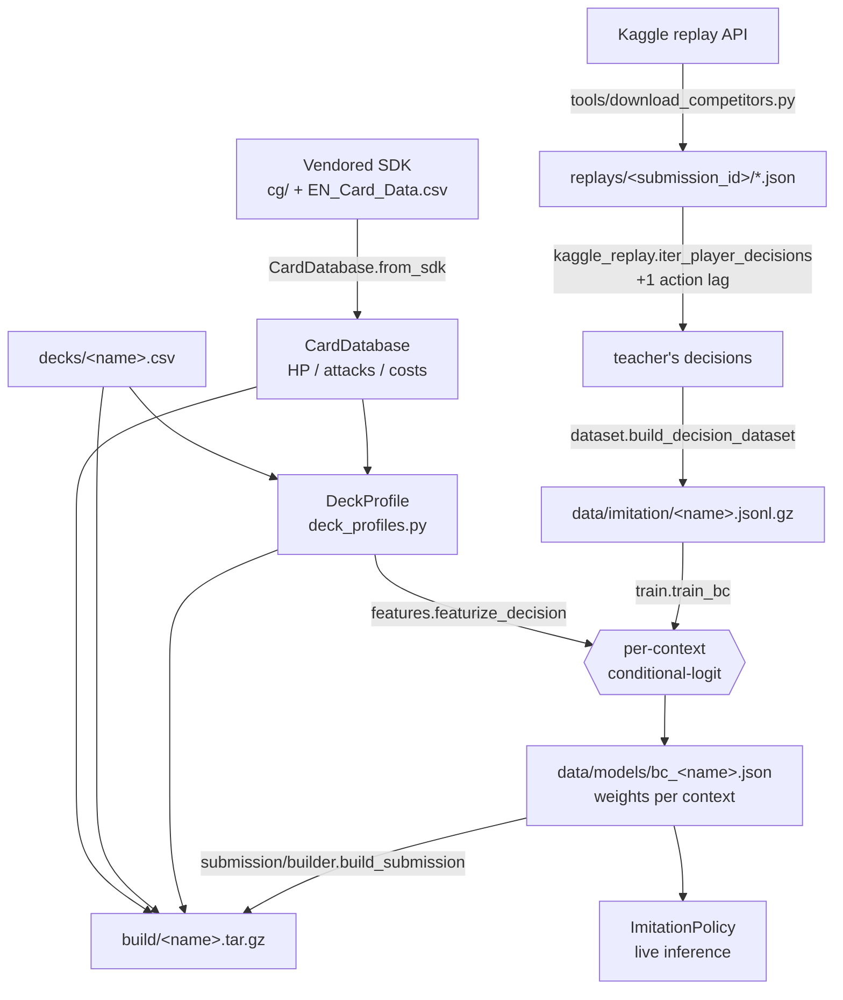

# ptcg-ai — Pokémon TCG AI Battle Challenge

Research framework for the Kaggle competition **"The Pokémon Company — PTCG AI Battle
Challenge (Simulation)"**: submit an autonomous agent that plays full Pokémon TCG games
against other submitted agents in the official simulator, under hidden information and
randomness, ranked on a TrueSkill-style ladder.

**What actually works:** the best agents are trained by **imitation learning** — a policy
learns to predict the move-by-move decisions recorded from a strong agent already on the
ladder (the competition publishes every submission's full replay log for exactly this),
piloting that agent's exact deck. The final submission finished **859th of 6,725 entries**
(top 13%, score 832.7). The write-up for the companion Strategy competition, covering the
reasoning behind every major decision, is [docs/strategy_writeup.md](docs/strategy_writeup.md).
Everything below explains how the agent is built, from "which cards exist" all the way to
the `.tar.gz` uploaded to Kaggle.

> **About this repository**: this is a curated public export of a larger private research
> project. The vendored competition SDK (`pokemon-tcg-ai-battle/`) and the competition's
> reference PDFs (`References/`) are excluded here, since they are official competition
> material with a no-redistribution license. Everything in this repository is first-party
> code and documentation.

---

## 1. The competition in 30 seconds

Your agent is a single Python callable:

```python
def agent(observation: dict) -> list[int]:
    ...
```

- **First call** (`observation["select"] is None`) → return a **60-card deck** as a list
  of card IDs.
- **Every later call** → return `minCount..maxCount` **unique indices** into
  `observation["select"]["option"]` (the legal choices the engine offers right now:
  which card to play, which attack, which target, discard, mulligan, …).

Resources per agent: **2 vCPU, 12.2 GiB RAM, no GPU, submission ≤197.7 MiB**, **~600 s
compute budget per episode** (no per-move timeout). Reward is **win/loss only**. Full
rules: [docs/competition_analysis.md](docs/competition_analysis.md).

---

## 2. The core idea: one decision interface, six "rungs"

Every decision the agent ever makes — deck submission, mulligan, setup, main phase,
mid-attack targeting — flows through **one interface** ([ADR-0004](docs/decisions/)):

```
Policy.choose(DecisionContext) -> list[int]
```

Policies are ordered by sophistication ("rungs"). Each rung was benchmark-gated before
adoption ([ADR-0006](docs/decisions/)): a new algorithm ships only if it measurably beats
the current one.

| Rung | Policy | Status |
|---|---|---|
| 1–2 | `random`, `safe-random` | floor / crash-backstop |
| 3 | `greedy` | shipped once (score ≈497–536); now used as a **baseline & fallback** |
| 4 | `rule-based` | built, never shipped (no gain over greedy) |
| 5 | `search` (determinized) | built, never shipped (underperforms — see findings) |
| **6** | **`imitation` (behavior cloning)** | **current best — the shipped agents** |

The shipped pipeline ([ADR-0013](docs/decisions/)):

```
raw obs dict
  → ObservationParser        (observation/parser.py)   tolerant dict → typed model
  → DecisionContext{raw, observation, cards}
  → GameState.build          (state/game_state.py)     perspective-normalized board + KO/threat math
  → per-context Handler       (decision/…)             picks the right sub-decision
  → Scorer                    (greedy or imitation)     ranks the legal options
  → SafePolicy                (decision/…)              validates indices, catches exceptions,
                                                        degrades to safe-random, logs interventions
```

`SafePolicy` wraps **every** policy so a scoring bug can never crash a game (it just falls
back). In production the intervention count should be **0**. Canonical detail:
[docs/decision_system.md](docs/decision_system.md).

---

## 3. Repository map

```
src/ptcg_ai/                 the research package (installed as `ptcg`)
  agent/          PTCGAgent — the Kaggle-shaped callable + deck loading/validation
  observation/    raw dict → ParsedObservation (tolerant parser)
  cards/          CardDatabase — static card knowledge (HP, attacks, costs, abilities)
  state/          GameState — derived board state, KO/threat/bench math
  decision/       the policies, one per rung: base, greedy, rule_based, search
  planning/       rung-5 search plumbing (built, not shipped)
  imitation/      rung-6 behavior cloning — THE current agent (see §4)
  submission/     Kaggle bundle builder + runtime entrypoint + validator
  environment/    vendored-SDK loader + battle adapter/runner
  config/         frozen-dataclass config + YAML profiles
  cli.py          the `ptcg` command (build, validate, bench, battle, …)

tools/            replay downloader + candidate pipeline (dev-only, see §4.2 / §4.6)
scratchpad/       research scripts: screens, gauntlets, diagnostics (NOT src-quality)
decks/            extracted 60-card decklists (card IDs, one per line)
data/             datasets + trained weights + downloaded candidate metadata
                  (GITIGNORED — local artifacts, not in version control)
replays/          downloaded Kaggle replay JSONs (GITIGNORED, ~GBs, re-downloadable)
build/            submission tarballs (gitignored; rebuilt on demand)
docs/             the full documentation set (see §7 and docs/index.md)
```

`pokemon-tcg-ai-battle/`, the vendored competition SDK, is not part of this public export
(official competition material, no-redistribution license). Code here that imports it
(`environment/sdk.py` and anything downstream) needs it placed at the repo root to run; the
SDK itself is obtained directly from the competition, not from this repository.

Two dependency tiers, enforced by the bundle builder:
- **Shipped code** (`observation/`, `cards/`, `state/`, `decision/{base,greedy}`,
  `imitation/{deck_profiles,features,policy}`) is **pure standard library** — it must run
  on Kaggle with no numpy/yaml/SDK.
- **Dev-only code** (`imitation/{kaggle_replay,dataset,train}`, `tools/`, `scratchpad/`)
  may use numpy etc. It builds and evaluates agents but never ships. Run it with
  `uv run --group dev …`.

---

## 4. How an agent is trained — the full pipeline

This is the heart of the project. A trained agent is **one `DeckProfile` + one weights
JSON**, produced by cloning a strong ladder bot's decisions on its own deck. The data
flows like this:



### 4.1 Card knowledge — "what cards exist"

Everything starts from the engine's card list. `CardDatabase.from_sdk(load_sdk(...))`
([cards/database.py](src/ptcg_ai/cards/database.py)) loads static knowledge for every card
— HP, attacks, energy costs, abilities, evolution lines — from the vendored SDK (backed by
`pokemon-tcg-ai-battle/EN_Card_Data.csv`). This is the single source of truth for "is
'Gholdengo ex' / 'Make It Rain' a real card here?" — strategy sourced from the real TCG
often names cards this engine's pool does **not** contain, so **every card claim is
verified against this CSV first** (a hard, repeated lesson: [docs/m17_findings.md](docs/m17_findings.md)).
`CardDatabase.to_records()` serializes it into the bundle so the shipped agent reasons
about cards **without** the native engine.

### 4.2 Get a teacher's games — `replays/`

We clone real bots, so we need their games. `tools/download_competitors.py --submissions
<id> --limit 150 --cookies tools/cookies.txt.json` pulls a submission's replay JSONs into
`replays/<submission_id>/`. Each replay records **both** agents' names + live rating, so
our own match history doubles as a ranked directory of opponents to clone
([tools/find_candidates.py](tools/find_candidates.py), [tools/next_batch.py](tools/next_batch.py)).

### 4.3 Extract the teacher's decisions — the dataset

[imitation/kaggle_replay.py](src/ptcg_ai/imitation/kaggle_replay.py) reads a replay and
yields one `ReplayDecision` per choice the target player made. Two subtleties it handles:
- **The +1 action lag**: `steps[i].observation` is answered by `steps[i+1].action`.
- It keeps only real decisions (an `ACTIVE` cell with a live `select`), skipping face-down
  prize picks and dead turns.

[imitation/dataset.py](src/ptcg_ai/imitation/dataset.py) `build_decision_dataset(log_dir,
player_name, out_path)` materializes those decisions to a gzip-JSONL file — **one decision
per line**, storing the raw observation, the chosen action, the context kind, and the
game's win/loss. `split_by_game()` then partitions rows into train/val by a deterministic
hash of the **game id** (the globally-unique Kaggle episode id), so no game's decisions
ever straddle the train/val boundary — a leak guarantee that holds even when concatenating
datasets from different players (verified in [docs/m24_findings.md](docs/m24_findings.md)).

```bash
uv run --group dev python -m ptcg_ai.imitation.dataset \
    replays/54708568 "懒惰的金枪鱼" data/imitation/kanga.jsonl.gz
```

### 4.4 Describe the deck — the `DeckProfile`

A clone needs to know *its own deck's* cards, attacks, and the damage/energy rules the
generic model gets wrong. That's a `DeckProfile`
([imitation/deck_profiles.py](src/ptcg_ai/imitation/deck_profiles.py)): the deck's
card/attack vocabulary plus small hand-authored functions:
- `damage_fn` — engine-exact damage (e.g. Kangaskhan's Rapid-Fire Combo at its guaranteed
  200; Rocket Rush = 30×Team-Rocket-in-play — "prose" damage the generic model misreads),
- `wants_fn` — which energy the deck wants,
- `snapshot_fn` — extra board signals (which attacker is active, combo readiness, …).

Adding a teacher is normally **one new `DeckProfile`**, not new code. For quick screening,
`build_generic_profile(name, deck, cards)` auto-derives a profile with no per-card tuning
(good enough to triage, never shipped — `get_profile` raises on it, so a generic bundle
would silently fall back to greedy). **A shippable clone needs a hand-authored profile.**

### 4.5 Featurize + train — the weights

[imitation/features.py](src/ptcg_ai/imitation/features.py) `featurize_decision(profile,
select, obs, gs, cards)` turns each legal option into a numeric vector (the profile makes
it deck-aware). The **exact same code** runs offline and live — no train/serve skew.

[imitation/train.py](src/ptcg_ai/imitation/train.py) `train_bc(dataset, deck, out, profile)`
fits **one linear conditional-logit scorer per context**: an option's score is
`w · φ(option)`, the policy is a softmax over a decision's options, trained by
cross-entropy against the teacher's actual choice. Context selection is data-driven — a
context is learned only if it has enough rows, greedy doesn't already predict it well, and
its options aren't degenerate; otherwise it defers to greedy. Output is
`data/models/bc_<name>.json`: the per-context weight vectors + fidelity metrics.

```bash
uv run --group dev python -m ptcg_ai.imitation.train \
    data/imitation/kanga.jsonl.gz decks/kanga.csv \
    data/models/bc_kanga.json KANGASKHAN_1052
```

The headline metric is **MAIN-context accuracy** ("fidelity"): how often the clone
reproduces the teacher's main-phase choice on held-out games. Why a plain **linear** model
and not something bigger: a one-hidden-layer MLP raised offline accuracy +9 pts but played
**worse** on the real ladder (it overfit one teacher's quirks) — see
[docs/m11_findings.md](docs/m11_findings.md) / m14. Higher capacity is off the table
without an explicit decision.

### 4.6 Evaluate before shipping

Offline fidelity is a proxy, not a verdict (it has mis-called the ladder several times).
Three tools, cheap → expensive:
- [scratchpad/quick_screen.py](scratchpad/quick_screen.py) — **triage**: deck strength
  (the deck piloted by greedy vs a 120-deck field) + clonability (generic-profile
  fidelity). Kills unpilotable decks fast.
- [scratchpad/head_to_head.py](scratchpad/head_to_head.py) — the discriminating gate: two
  clones over the identical field, paired per-deck delta with a bootstrap CI
  (`--baseline` to compare any two clones).
- [scratchpad/field_gauntlet.py](scratchpad/field_gauntlet.py) — the full paired promotion
  gate vs the current champion.

The honest limit (proven repeatedly): **no offline instrument resolves a subtle pilot
difference** — the real ladder is the only judge. The `docs/m*_findings.md` series is the
running record of what was tried and why it did/didn't work.

### 4.7 Bundle it — the `.tar.gz`

[submission/builder.py](src/ptcg_ai/submission/builder.py) `build_submission(config,
weights_path=...)` stages a Kaggle tarball with everything the agent needs and **nothing
else**:
- `main.py` — the runtime entrypoint (`submission/_entrypoint.py`): imitation → greedy →
  inline safe-random, checked per decision, never raises.
- `deck.csv` — the 60-card deck.
- `card_data.json` — `CardDatabase.to_records()` (so no engine needed live).
- `bc_weights.json` — the trained weights (omit this and the bundle is a plain greedy
  agent; the imitation modules stay inert).
- `ptcg_ai/` — a **pruned, stdlib-only** subtree: only the `_AGENT_MODULES` the decision
  path imports (no config/yaml/SDK), copied verbatim so shipped == tested.
- `cg/` — the vendored SDK (bundled for layout parity; unused by the imitation entrypoint).

```bash
# convenience wrapper (deck, weights, out-name all as argv):
uv run --group dev python scratchpad/build_imitation.py \
    decks/kanga.csv data/models/bc_kanga.json imitation-kanga
uv run ptcg validate-submission build/imitation-kanga.tar.gz
```

`ptcg build-submission` with no weights still produces a plain **greedy** agent — shipping
a clone requires passing `weights_path` (that's what `build_imitation.py` does).

### 4.8 Live inference

On Kaggle, [imitation/policy.py](src/ptcg_ai/imitation/policy.py) `ImitationPolicy`
(a subclass of `GreedyPolicy`) loads `bc_weights.json`: for a **learned** context it
featurizes the options, scores them with the linear weights (a plain stdlib dot product —
microseconds per option), and takes the top-k the teacher's rule dictates; for **any other**
context, failure, or prize pick, it defers to greedy. Zero interventions across thousands
of analyzed games.

---

## 5. The research method

- **Benchmark-gated** ([ADR-0006](docs/decisions/)): no algorithm ships without a measured
  win. "No ship" is a valid, common outcome.
- **Milestone findings** (`docs/m6_findings.md` through `docs/m49_findings.md`, 44 documents):
  each milestone is written so a fresh session doesn't re-run an exhausted idea. The
  load-bearing lessons: cloning skill beats heuristics (M6→M7); **clonability of the exact
  pilot's build beats teacher elo** (M8/M23/M45, confirmed four separate times); higher
  fidelity to a mediocre teacher plays *worse* (M11/M14, and five more times after that);
  the offline gauntlet is a veto, not a ranker, in the ±0.05 band (M22/M25); a converged
  ladder score alone carries ±60-100 elo of pure opponent-pool noise, so every decisive
  comparison in this project runs 600 paired games against a self-mirror noise control
  (M29/M41); the one intervention that measurably won on the real ladder was finding that
  12% of all decisions fell through to an unmodeled default policy, not a fidelity
  refinement (M42/M43/M44). Self-play reinforcement learning was attempted and closed with
  a quantified mechanism, not just a negative result (M38, M47, M48).
- **Start every session at [docs/handoff.md](docs/handoff.md)** — the point-in-time state
  banner, newest milestone first.
- **The Strategy write-up**: [docs/strategy_writeup.md](docs/strategy_writeup.md) is the
  condensed, public-facing version of all of the above.

---

## 6. Quickstart

```bash
uv sync                                              # install (uv is the package manager)
uv run pytest -q                                     # test suite (add --group dev if touching train.py)
uv run ptcg battle --trace build/trace.jsonl         # a traced local battle
uv run ptcg bench all                                # engine/parser/search benchmarks
uv run ptcg build-submission                         # greedy tarball
uv run ptcg validate-submission build/submission.tar.gz
```

Everything runs through **`uv run`**. Dev-only tooling (numpy) needs **`uv run --group dev`**.

---

## 7. Where to go deeper

- **Documentation map**: [docs/index.md](docs/index.md)
- **Architecture**: [docs/architecture.md](docs/architecture.md) ·
  **Decision system**: [docs/decision_system.md](docs/decision_system.md)
- **The game & rules**: [docs/competition_analysis.md](docs/competition_analysis.md) ·
  **Observations**: [docs/battle_flow.md](docs/battle_flow.md) ·
  **Every field's meaning**: [docs/feature_inventory.md](docs/feature_inventory.md)
- **Why it's built this way**: [docs/decisions/](docs/decisions/) (ADRs)
- **What was tried**: `docs/m6_findings.md` → `docs/m49_findings.md`
- **The Strategy write-up**: [docs/strategy_writeup.md](docs/strategy_writeup.md)
