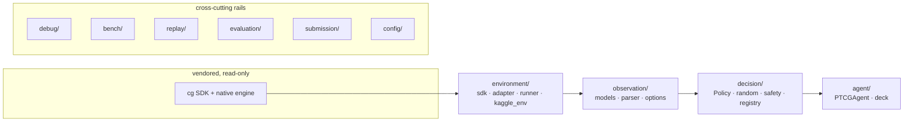

# Architecture

Design goals, in priority order: **submission safety** (never crash, never
miss a validation gate), **research velocity** over six weeks, **SDK
isolation** (survive vendor drops), **algorithm agnosticism** (ADR-0006),
**observability** (ADR-0009), and simplicity — modules exist only when a
current phase exercises them.

## Layers

Only `environment/sdk.py` imports `cg` (ADR-0002). Everything downstream
consumes raw dicts (`RawObs`) or parsed models.

## The two artifacts (ADR-0001)

1. **Research package** `src/ptcg_ai/` — installable, any deps, all tooling.
2. **Submission tarball** `build/*.tar.gz` — `main.py` (from
   `submission/_entrypoint.py`, stdlib-only, never imports `ptcg_ai`),
   `deck.csv`, and a copy of `cg/`. Produced by `ptcg build-submission`,
   gated by `ptcg validate-submission`.

## Module responsibility table

| Module | Owns | Depends on | Must NOT |
|---|---|---|---|
| `config/` | schema + YAML profile loading | utils | import anything above it |
| `environment/` | all `cg` contact; battle hosting; Kaggle harness wrapper | config, replay (runner) | leak `cg` types upward |
| `observation/` | tolerant parsing; option helpers | — | touch the SDK |
| `cards/` | static card knowledge (converted to our types) | environment (load only) | expose `cg` objects |
| `decision/` | Policy protocol, baselines, safety, registry | observation, cards, config | know about hosting |
| `agent/` | Kaggle-contract façade; deck load/validate | decision, observation, cards | contain strategy |
| `debug/` | pretty-printing, decision traces | observation, decision, cards | be required for correctness |
| `bench/` | throughput/latency measurements (ADR-0006) | environment, observation, cards | contain algorithms |
| `replay/` | episode JSONL storage (ADR-0008) | — | store parsed objects |
| `evaluation/` | arena matchups, match stats | environment, agent, decision | — |
| `submission/` | entrypoint template, builder, validators | agent (deck), config | import the research stack from the entrypoint |
| `cli.py` | user-facing workflows | everything | contain logic beyond glue |

## Extension points

- **`Policy`** (`decision/base.py`) — the one interface every decision
  engine implements; registered by name in `decision/registry.py`.
- **`FeatureExtractor` / `Determinizer` / `BeliefTracker`** — *not yet
  created* (see Growth Plan); their contracts are sketched in
  [state_representation.md](state_representation.md).

## Growth Plan (deferred modules and their triggers)

Modules are created the week their phase starts — not before
(review principle: no speculative scaffolding).

| Future module | Created when | Purpose |
|---|---|---|
| `state/game_state.py` | Phase 2, with the first heuristic policy | perspective-normalized snapshot + derived tactical quantities |
| `decision/greedy.py`, `decision/rule_based.py` | Phase 2 | ladder rungs 3–4 |
| `state/beliefs.py` | Phase 2–3 (search or opponent modeling) | track seen cards, infer remaining hidden zones |
| `planning/` (`SearchSession`, `Determinizer`) | after ADR-0010 approves search | reusable wrapper extracted from `bench/bench_search.py` |
| `features/` | Phase 3 (learning) | state → vector encoding |
| `training/` | Phase 3 | self-play data generation, trainers |
| `experiments/` | first tracked experiment | experiment configs + results log |
| `decision/rl_policy.py` | Phase 3 | learned policy inference |

## Import rules (enforced by review; a lint gate is future work)

1. `import cg` only in `environment/sdk.py`.
2. `submission/_entrypoint.py` imports **nothing** from `ptcg_ai`.
3. Nothing imports from `cli.py`.
4. `observation/`, `replay/`, `config/` stay SDK-free (unit-testable
   anywhere).
