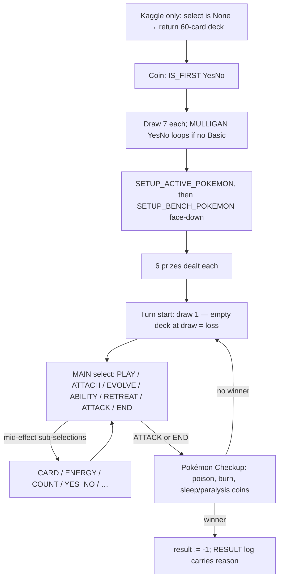

# Battle Flow

How a full episode looks from the agent's seat. Sources: engine C++ (state
machine in `GameProc.h`/`SetupProc.h`), the SDK, and our captured fixtures.

## Episode lifecycle

**Local vs Kaggle difference**: locally, decks go directly into
`battle_start(deck0, deck1)` — the `select is None` deck-submission call
exists **only under the Kaggle harness**. Our `PTCGAgent` handles both;
fixture `000_first_call.json` is synthetic for exactly this reason.

## Turn numbering and acting player

`State.turn`: 1 = first player's first turn, 2 = second player's first turn,
3 = first player's second turn, … (0 = pre-game). The observation is always
built for the player who must act: `current.yourIndex`. The runner routes
observations by that field.

First-turn restrictions enforced by the engine: no attack on turn 1, no
supporter on the first player's first turn; per-turn once-only flags are in
the observation (`supporterPlayed`, `stadiumPlayed`, `energyAttached`,
`retreated`).

## Decision-point taxonomy

The engine asks for every decision through one mechanism: `select` with
typed options; the agent answers with option indices. Observed kinds
(fixtures in `tests/fixtures/observations/` cover most):

| SelectType | Typical contexts | Options | Notes |
|---|---|---|---|
| MAIN | MAIN | PLAY, ATTACH, EVOLVE, ABILITY, DISCARD, RETREAT, ATTACK, END | the big turn decision; END always present |
| CARD | SETUP_ACTIVE/BENCH, SWITCH, TO_HAND, DISCARD, DAMAGE targets, ATTACH_TO/FROM, … | CARD | target selection mid-effect; `deck` non-None when picking from your deck |
| ATTACHED_CARD | DISCARD_ENERGY_CARD, DISCARD_TOOL_CARD, … | TOOL_CARD, ENERGY_CARD | attachments on a Pokémon |
| ENERGY | DISCARD_ENERGY, SWITCH_ENERGY, … | ENERGY | `remainEnergyCost` counts down |
| ATTACK | ATTACK, DISABLE_ATTACK | ATTACK | includes bench attackers when legal |
| EVOLVE | EVOLVE | EVOLVE | source + target pairs |
| SKILL | SKILL_ORDER | SKILL | effect-ordering choices |
| COUNT | DRAW_COUNT, DAMAGE_COUNTER_COUNT, … | NUMBER | pick a quantity |
| YES_NO | IS_FIRST, MULLIGAN, ACTIVATE, COIN_HEAD, … | YES, NO | includes going-first and optional effects |
| SPECIAL_CONDITION | AFFECT/RECOVER_SPECIAL_CONDITION | SPECIAL_CONDITION | rare |

`minCount` can be 0 (selection optional); `maxCount` bounds the pick.
`remainDamageCounter` supports damage-counter placement effects.

**Measured frequencies** (random play, sample deck, N=1000 games): only 11
of the ~49 contexts appear; MAIN/MAIN is 70.4% of all decisions with mean
branching 7.8 (max 50). Full tables: [game_analysis.md](game_analysis.md)
§1–2. Context coverage is deck-dependent — recheck per archetype.

## Selection validity rules

`minCount <= len(action) <= maxCount`; unique indices; each in
`[0, len(option))`. The engine rejects violations (error 4/5/6) — which in
ranked play means a forfeited game, hence `SafePolicy`.

**Terminal-observation caveat (measured, not documented)**: the final
observation (`result != -1`) still carries a `select` whose counts can
exceed its **empty** option list (fixture `021_terminal.json`:
`minCount=1, maxCount=1, option=[]`). The documented invariant "maxCount
never exceeds len(option)" holds only at genuine decision points. Policies
must not crash on this shape; `RandomPolicy` and the submission entrypoint
clamp for exactly this reason.

## Logs between decisions

`obs["logs"]` carries every event since the agent's previous decision —
including everything the opponent did (with `*_REVERSE` variants hiding card
identities). This is the only way to observe the opponent's turn; a future
`BeliefTracker` consumes it. `LogType.RESULT` carries the finish
`reason`: 1 = prizes taken, 2 = deck-out, 3 = no Active Pokémon,
4 = card effect. `State.result`: -1 ongoing, 0/1 winner, 2 draw.

## Known unknowns (empirical checklist, Phase 1)

- [ ] Per-move time budget on Kaggle (Q1) — and what happens on timeout.
- [ ] Decision-count distribution for competent (non-random) play (Q2).
- [ ] Which rare SelectContexts appear in real games (fixture coverage).
- [ ] Draw frequency under the engine's hard caps (Q6).
- [ ] Exact `looking` semantics during deck-search effects.
